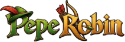

<div align="center">



# PEPEROBIN ($PEPEHOOD)

### Pepe the Robinhood on Solana. Take from the rich. Give to the degens. 🏹

[](https://peperobin.com)
[](https://solana.com)
[](#-responsive-design)
[](https://peperobin.com)

</div>

---

## 📖 Table of Contents

1. [About the project](#-about-the-project)
2. [Features](#-features)
3. [Page sections](#-page-sections)
4. [Tokenomics](#-tokenomics)
5. [Design system](#-design-system)
6. [Tech stack](#-tech-stack)
7. [Project structure](#-project-structure)
8. [Getting started](#-getting-started)
9. [How the partials system works](#-how-the-partials-system-works)
10. [Customization guide](#-customization-guide)
11. [Adding or editing memes](#-adding-or-editing-memes)
12. [Responsive design](#-responsive-design)
13. [SEO and social sharing](#-seo-and-social-sharing)
14. [Performance and accessibility](#-performance-and-accessibility)
15. [Pre-launch checklist](#-pre-launch-checklist)
16. [Deployment](#-deployment)
17. [Code style](#-code-style)
18. [Credits](#-credits)
19. [Disclaimer](#-disclaimer)

---

## 🏹 About the project

Once upon a time, Pepe disappeared. The city grew darker, the rich grew richer, and the little guys of the Solana community were left behind.

**PEPEROBIN** is the return of Pepe as the Robin Hood of Solana: a community-first memecoin built around one idea. On Solana, the strongest force isn't a whale. It's thousands of people moving together.

This repository is the official landing page at **[peperobin.com](https://peperobin.com)**. It tells the story, shows the tokenomics, gives visitors ready-to-share memes, and makes the contract address one click to copy.

---

## ✨ Features

| Area | What it does |
| --- | --- |
| **Cinematic hero** | Full-screen medieval Solana banner with the big headline "Pepe the Robinhood on Solana Chain.", a neon **Buy from Pinksale** button and Telegram and Twitter/X buttons. |
| **Sticky navbar** | Logo, section links, and X and Telegram pill buttons. A **scroll-progress bar** runs under it and a **red diamond** marks the section you're viewing. |
| **Scrolling marquee** | A slanted, hazard-tape ticker with the key phrases ("Take from the rich", "Pepe the Robinhood", "$PEPEHOOD"). |
| **Story section** | The full PepeRobin legend told beside the hero illustration, with gold and neon highlight lines. |
| **Tokenomics** | An interactive donut chart and seven allocation cards with progress bars. The active card and the chart's centre text stay in sync. |
| **Memes section** | 10 shareable memes with **category filters** (All, Bullish, Pain, Holding, Legend). Each has a **Download** button and a **Tweet** button that opens X with the meme's title as the post text. |
| **Contact address card** | A long gold card with the contract address and a **one-click Copy** button, with a "Copied!" confirmation and a clipboard fallback. |
| **Footer** | Logo, navigation, X and Telegram icon buttons, a copyright line and a "not financial advice" disclaimer. |
| **Responsive** | Built for two targets only: **desktop** and **mobile** (one column on mobile). |
| **Modern UX** | Big type, chunky gold-framed buttons, hover shine, smooth transitions, reduced-motion support and visible keyboard focus. |

---

## 🧭 Page sections

The page is built in this order, and each section has an anchor for the navbar:

| Order | Section | Anchor | Notes |
| --- | --- | --- | --- |
| 1 | Navbar | n/a | Sticky, with scroll progress and active-link indicator |
| 2 | Hero | n/a | Headline, buy button, socials |
| 3 | Marquee | n/a | Animated ticker |
| 4 | Story | `#story` | The return of PepeRobin |
| 5 | Tokenomics | `#token` | Donut chart and allocation cards |
| 6 | Memes | `#memes` | "Pick your Robin." |
| 7 | Contact address | `#contact` | Contract address with copy button |
| 8 | Footer | `#footer` | Links, socials, legal |

> **Heads up:** the footer nav links to `#token`, but the navbar label reads **Tokenomics**. Make sure the Tokenomics section's `id` matches the `href` used in both the navbar and the footer.

---

## 🪙 Tokenomics

| Allocation | Share | Notes |
| --- | --- | --- |
| Fairlaunch | **40%** | Open to everyone |
| Community Rewards | **20%** | Given back to the community |
| Private Sale | **10%** | |
| CEX partnership | **10%** | |
| Burn | **10%** | |
| Treasure | **6%** | |
| Team | **4%** | |
| **Total** | **100%** | |

To change a number, update both the card and the matching chart segment so they stay in sync.

---

## 🎨 Design system

A forest, gold and red palette on a dark base. These are defined as CSS variables (they're also inlined in the `<head>` to prevent a white flash before the CSS loads).

| Token | Value | Used for |
| --- | --- | --- |
| `--bg` | `#0E1A12` | Page background (deep forest) |
| `--card` | `#16271B` | Cards and panels |
| `--green` | `#2E7D32` | Primary green |
| `--green-bright` | `#39FF14` | Neon accent, hover glow, success states |
| `--gold` | `#D4A017` | Buttons, borders, highlights |
| `--red` | `#D62828` | Headings, from the logo |
| `--text` | `#F5F1E6` | Parchment-white text |

### Typography

| Font | Role |
| --- | --- |
| **Bangers** (`Bangers-Regular`) | Big display headings, buttons, nav links |
| **Cinzel Decorative** (`CinzelDecorative-Bold`) | Story subheadings, meme titles, taglines |
| **Poppins** | Body text, captions, legal text |

Fonts live in `assets/fonts/`. Make sure each `@font-face` uses exactly these family names: `Bangers`, `Cinzel Decorative`, `Poppins`.

### Design principles

- **Big everything.** Text, images, buttons and tap targets are deliberately oversized.
- **Chunky "comic" buttons.** Thick gold borders with a hard offset shadow that presses down on click.
- **One neon accent.** Bright green is used for hover, success and calls to action.
- **Tilted cards.** Meme cards sit at slight angles and straighten on hover.

---

## 🛠 Tech stack

- **HTML5** with reusable **partials**
- **CSS3** with custom properties, grid, flexbox and `clamp()` fluid sizing
- **Vanilla JavaScript (ES modules)** for the marquee, tooltips, filters, copy and download
- **JSX** for the navbar component (`navbar.jsx`)
- **ESLint** and **Prettier** for code quality
- **npm** for tooling

---

## 📁 Project structure

```
pepe-robin/
├── assets/
│   ├── css/
│   │   ├── layout/
│   │   │   ├── hero.css
│   │   │   ├── marquee.css
│   │   │   ├── navbar.css
│   │   │   ├── memes.css        # Memes section
│   │   │   ├── contact.css      # Contact address card
│   │   │   └── footer.css       # Footer
│   │   └── main.css             # Global styles and variables
│   ├── fonts/                   # Bangers, Cinzel Decorative, Poppins
│   ├── images/
│   │   ├── desktop/
│   │   │   ├── backgrounds/     # Hero and social banners
│   │   │   ├── logos/
│   │   │   └── photos/          # photo-1.webp … photo-10.webp
│   │   ├── mobile/
│   │   │   ├── backgrounds/     # banner.webp
│   │   │   ├── logos/           # logo.webp
│   │   │   └── photos/          # photo-1.webp … photo-10.webp
│   │   └── fire.gif
│   └── js/
│       ├── modules/
│       │   ├── buy-tooltip.js
│       │   ├── include.js       # Loads partials into the page
│       │   ├── memes.js         # Filters, download, tweet
│       │   ├── contact.js       # Copy-to-clipboard
│       │   └── footer.js        # Auto-updating copyright year
│       ├── main.js              # Entry point
│       ├── marquee.js
│       └── navbar.jsx
├── partials/
│   ├── hero.html
│   ├── navbar.html
│   ├── memes.html
│   ├── contact.html
│   └── footer.html
├── .editorconfig
├── .eslintrc.json
├── .gitignore
├── .prettierrc
├── 404.html
├── favicon.png
├── index.html
├── package.json
└── package-lock.json
```

---

## 🚀 Getting started

### Prerequisites

- **Node.js** 18 or newer ([download](https://nodejs.org))
- **npm** (comes with Node.js)
- **Git**

### 1. Clone the repository

```bash
git clone <your-repository-url>
cd pepe-robin
```

### 2. Install dependencies

```bash
npm install
```

### 3. Start the dev server

```bash
npm run dev
```

Then open the local URL printed in your terminal (usually `http://localhost:5173`).

> The exact script names depend on your `package.json`. Run `npm run` to list what's available, and update the commands in this README to match (for example `dev`, `build`, `preview`, `lint`, `format`).

### 4. Build for production

```bash
npm run build
```

### 5. Lint and format

```bash
npm run lint      # ESLint
npm run format    # Prettier
```

> Partials are loaded with `fetch`, so open the site through a **local server**. Opening `index.html` directly with `file://` will not load them.

---

## 🧩 How the partials system works

The page is split into small HTML files in `partials/` so each section is easy to edit on its own. `assets/js/modules/include.js` injects them into `index.html`.

```html
<!-- index.html (example) -->
<div data-include="partials/navbar.html"></div>
<div data-include="partials/hero.html"></div>
<!-- … story, tokenomics … -->
<div data-include="partials/memes.html"></div>
<div data-include="partials/contact.html"></div>
<div data-include="partials/footer.html"></div>
```

Check `include.js` for the exact attribute name your project uses, and keep the section order from [Page sections](#-page-sections).

### Adding a new section

1. Create `partials/your-section.html`.
2. Create `assets/css/layout/your-section.css` and link it in `index.html`.
3. If it needs behaviour, create `assets/js/modules/your-section.js` and import it in `main.js`.
4. Include the partial in `index.html`.
5. Add a navbar link if visitors should be able to jump to it.

The Memes, Contact and Footer scripts use **event delegation**, so they still work when their partial is injected after the script loads.

---

## 🎛 Customization guide

### Contract address

Edit one line in `partials/contact.html`:

```html
<p class="contact__address" id="contact-address">YOUR_CONTRACT_ADDRESS</p>
```

The copy button reads whatever text is in that element, so nothing else needs to change.

### Social links

Replace the placeholder links everywhere they appear: the navbar, the hero buttons, the footer nav and the footer icons.

| Placeholder | Replace with |
| --- | --- |
| `https://x.com/home` | Your real X (Twitter) profile URL |
| `https://web.telegram.org/a/` | Your real Telegram group or channel invite |

External links should keep `target="_blank" rel="noopener noreferrer"`.

### Buy button

The hero buy button currently reads **Buy from Pinksale**. Point it at your live Pinksale (or launchpad) link.

### Colors and fonts

Change the variables at the top of `assets/css/main.css` (and the small inline `<style>` in `index.html`). Every section reads from the same tokens.

---

## 🖼 Adding or editing memes

Each meme card in `partials/memes.html` has three things to know:

```html
<article class="meme-card" data-category="bullish" data-title="The comeback has begun. 🏹">
```

| Attribute | Purpose |
| --- | --- |
| `data-category` | Which filter shows this card: `bullish`, `pain`, `holding` or `legend` |
| `data-title` | The caption under the image **and** the text used for the **Tweet** button |
| `` / `<source>` | Desktop image and mobile image paths |

### Steps to add a meme

1. Add two versions of the image, both as `.webp`:
   - `assets/images/desktop/photos/photo-11.webp`
   - `assets/images/mobile/photos/photo-11.webp`
2. Duplicate an existing `<article class="meme-card">…</article>` block.
3. Update the image paths, `alt` text, `data-category`, `data-title` and the visible title.

### Adding a new category

1. Add a filter button:
   ```html
   <button type="button" class="chip" role="tab" aria-selected="false" data-filter="gm">GM</button>
   ```
2. Set `data-category="gm"` on the cards that belong to it.

### How the buttons behave

- **Download** saves the exact image the visitor sees (desktop or mobile version).
- **Tweet** opens `x.com/intent/post?text=<meme title>` in a new tab.

---

## 📱 Responsive design

The site targets **two layouts only**:

| Screen | Behaviour |
| --- | --- |
| **Desktop** (768px and up) | Multi-column layouts. The memes grid is 3 columns on wide screens and 2 on mid-size screens. |
| **Mobile** (below 768px) | **One column.** Larger tap targets, stacked and centered footer, full-width buttons. |

The mobile breakpoint is `@media (max-width: 767px)`. Meme images are swapped with a `<picture>` element, so phones load the smaller mobile files.

---

## 🔍 SEO and social sharing

The `<head>` of `index.html` already includes:

- Title, description and keywords
- Canonical URL (`https://peperobin.com`)
- Robots directives
- **Open Graph** tags (Facebook, Telegram, Discord previews)
- **Twitter Card** tags (`summary_large_image`)
- Theme color and app meta tags
- Favicon, and preconnect and DNS-prefetch hints

Social preview image: `assets/images/desktop/backgrounds/1200x630-banner.webp` (1200 × 630).

---

## ⚡ Performance and accessibility

**Performance**

- WebP images throughout, with separate desktop and mobile sizes
- Lazy-loaded meme images, and a high-priority logo
- Critical colors inlined so there's no white flash
- `preconnect` and `dns-prefetch` for external origins
- No heavy frameworks: vanilla JS, with JSX only for the navbar

**Accessibility**

- Semantic sections with `aria-labelledby`
- Alt text on every image
- Visible keyboard focus on buttons and links
- Screen-reader announcements for the copy confirmation
- `prefers-reduced-motion` respected across the new sections

---

## ✅ Pre-launch checklist

Before pointing the domain at production, confirm each of these:

- [ ] **Contract address is correct for the chain.** The current value in `contact.html` is in Ethereum/EVM format (`0x…`, 42 characters). Solana addresses are base58, 32–44 characters, with no `0x`. Verify it against your launchpad page, because visitors copy this to buy.
- [ ] Replace the X and Telegram placeholders (`x.com/home`, `web.telegram.org/a/`) in the navbar, hero and footer.
- [ ] Replace `@YOUR_TWITTER_HANDLE` in the `twitter:site` and `twitter:creator` meta tags.
- [ ] Confirm the **Buy** button links to the live sale.
- [ ] Confirm `assets/images/desktop/backgrounds/1200x630-banner.webp` exists and loads at `https://peperobin.com/...`.
- [ ] Check every anchor (`#story`, `#token`, `#memes`, `#contact`) matches a real section `id`.
- [ ] Make sure only **one** element on the page uses `id="site-nav"`. The footer nav uses `footer-nav`.
- [ ] Test on a real phone and a desktop browser.
- [ ] Test **Copy**, **Download** and **Tweet** on both layouts.
- [ ] Check `404.html` works on your host.
- [ ] Run `npm run lint` with no errors.
- [ ] Check the disclaimer text with your legal advisor for your jurisdiction.

---

## 🌍 Deployment

The site is static, so it can be hosted almost anywhere.

| Host | Steps |
| --- | --- |
| **Vercel** | Import the repo → framework preset matching your build tool → deploy |
| **Netlify** | New site from Git → build command `npm run build` → publish directory (usually `dist`) |
| **Cloudflare Pages** | Connect the repo → same build command and output folder |
| **GitHub Pages** | Push the build output to the `gh-pages` branch |

After deploying, point **peperobin.com** at your host through your DNS provider and enable HTTPS.

---

## 🧹 Code style

The repo ships with:

- `.editorconfig` for consistent indentation and line endings
- `.prettierrc` for formatting
- `.eslintrc.json` for JavaScript rules

Guidelines used across the project:

- Section CSS is **scoped** under its own class (`.memes`, `.contact`, `.footer`) so styles never clash.
- Buttons and links keep the same interaction pattern: lift on hover, press on click.
- One responsibility per JS module.

---

## 👏 Credits

- **Concept and community:** the PepeRobin team
- **Website development:** Adon Bhuiyan ([adon.dev](https://adon.dev))
- **Fonts:** Bangers, Cinzel Decorative and Poppins (Google Fonts, SIL Open Font License)

---

## ⚠️ Disclaimer

**Not financial advice.** $PEPEHOOD is a meme coin made for entertainment and community fun. It has no intrinsic value and no promise of returns. Crypto is highly volatile and you can lose everything you put in. Always do your own research and never invest more than you can afford to lose.

<div align="center">

**🏹 THE COMEBACK HAS BEGUN. 🏹**

</div>
